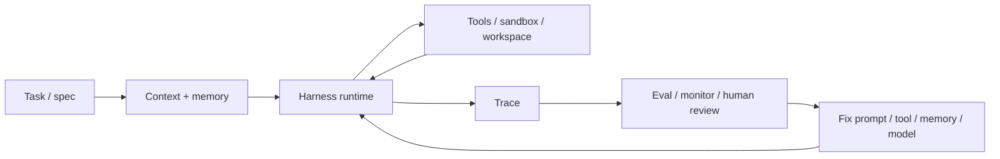

# Agent Harness 与 Trace Eval

Agent harness 是 **agent 的运行时层**：它把模型、指令、上下文、工具、状态、权限、沙盒、trace 和恢复策略组织成一个可运行系统。

Trace eval 是 **对运行过程的评估层**：它消费 harness 产生的 trace、工具调用、状态变化和最终产物，判断 agent 是否可靠。

核心边界：**harness 让 agent 可运行且可观测；eval 让 agent 可判断且可改进。**

[[concepts/ReasoningEvalVerifier边界]] 进一步细化了 trace eval 中的评分器：final-state grader 判断结果，process verifier 判断推理步骤，trace grader 判断完整 trajectory，CoT monitor 判断暴露 reasoning 中的风险信号。

当 agent 进入视觉、音频、3D 或机器人环境，[[concepts/MultimodalEvalSimulationEval边界]] 会把 trace eval 扩展为 environment-state eval：除了 transcript，还要评估感知、物理一致性、动作安全、碰撞、低层控制和跨环境泛化。

## 组成

| 组件 | 作用 | 主层级 |
|---|---|---|
| Runner / loop | 控制模型回合、工具调用、handoff、停止条件 | 5 Agent 系统层 |
| Tool registry | 暴露可调用工具、schema、权限和失败处理 | 5 Agent 系统层 |
| State / session | 保存任务状态、短期历史、恢复点 | 5 Agent 系统层 |
| Workspace / sandbox | 限制文件、网络、命令和副作用范围 | 5 Agent 系统层 |
| Guardrail / approval | 在高风险动作前拦截或请求人工确认 | 6 评估与可靠性层 |
| Trace / span | 记录每轮推理、工具调用、输入输出和错误 | 5 → 6 桥梁 |
| Eval harness | 批量运行任务、收集分数、回归比较 | 6 评估与可靠性层 |

[[concepts/ToolRiskPermissioning边界]] 将 permissions / guardrails 进一步拆成动作准入：每次 tool call 先判断风险层、数据范围、凭证、审批、沙箱和审计，再允许执行。

## 与相邻概念的区别

| 概念 | 不是 harness 的部分 | 与 harness 的关系 |
|---|---|---|
| Prompt engineering | 只写一次指令 | prompt 是 harness 的输入之一 |
| Context engineering | 组织进入上下文的信息 | harness 决定何时取用上下文和 memory |
| Tool use | 一次工具调用能力 | harness 管理工具注册、权限、重试、错误 |
| Workflow | 固定步骤编排 | harness 可以运行 workflow，也可以运行开放 agent loop |
| Eval | 质量判断 | eval 消费 harness trace 和最终状态 |
| Product UI | 用户交互界面 | UI 调用 harness，harness 执行任务 |

## 稳定链路

## 评估方式

- **最终状态**：任务产物、测试、环境状态是否正确。
- **工具行为**：工具选择、参数、重试、权限边界是否合理。
- **权限行为**：tool risk tier、policy result、approval state、credential scope 和 rollback evidence 是否完整。
- **治理证据**：高风险 trace 是否进入 release gate、incident review 或 risk register。
- **Trace 质量**：是否出现无效循环、幻觉工具、上下文遗漏、错误恢复失败。
- **成本与延迟**：token、工具调用、运行时间、失败重跑成本。
- **可靠性指标**：pass@k 评能力上界，pass^k 评可靠性下界。

## 工程原则

- 先有最小 harness：明确工具、工作区、停止条件、trace。
- 再加 eval：从 20-50 个真实失败案例启动回归套件。
- 不只评最终回答；agent 会改变环境，必须评最终状态和 trace。
- 高风险动作要有 sandbox、权限、approval 或可回滚机制。
- 通用执行工具、浏览器、computer use 和 MCP server 要经过独立权限门，不能只靠 prompt 指令约束。
- trace 要能反哺第 4 层 memory/context、第 6 层 eval、第 8 层 self-improvement。

## 过时风险

- 某些手写 loop 会被模型原生工具调用、托管 agent 或 SDK 吸收。
- 具体 tracing schema 会换；但“可观测运行时 → eval → 回填改进”的结构不会过时。
- 如果模型变强，harness 的复杂度可能下降，但权限、状态、trace 和评估不会消失。
