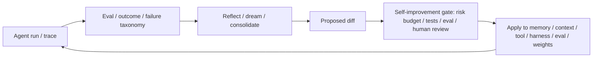

# Dream 与 Self-Improvement 工程原语

Dream / self-improvement 不是“模型突然自己变聪明”，而是一个**带外反馈环**：

`运行 trace → eval/失败归因 → 反思/巩固 → 生成改动 → self-improvement gate → 审查/验证 → 应用到 memory、context、tool、harness、eval 或 weights`

主归属：**8. 自我改进与前沿层**。它不是孤岛，而是反哺第 2、4、5、6 层。

## 三档成熟度

| 档位 | 改什么 | 代表机制 | 风险 |
|---|---|---|---|
| L1 记忆巩固 | memory / knowledge | Dreaming、DreamCycle、Reflexion | 记错、过时、污染 |
| L2 系统改造 | prompt / context / tool / harness / eval | 智能体 GC、自主 research loop、SIA harness update | 规则漂移、过拟合 eval |
| L3 权重更新 | adapter / fine-tune / model weights | SEAL、SIA weight update | 数据污染、安全、不可逆回归 |

稳定判断：**先改外部系统，最后才改权重**。越靠近权重，越需要 hold-out eval、审计和人工门。

## 最小闭环

## 与相邻概念的区别

| 概念 | 区别 |
|---|---|
| Memory | 保存经验；Dream 负责整理、去重、纠错和提升可用性 |
| RAG | 检索外部知识；Dream 从运行历史抽取经验和失败模式 |
| Eval | 判断系统好坏；Self-improvement 用 eval 结果生成改动 |
| Harness | 运行 agent；Self-improvement 可以改 harness，但必须通过 eval 验证 |
| Fine-tuning | 改权重；Self-improvement 不等于一定改权重 |
| Reward hacking | self-improvement 最危险的失败模式之一：系统学会优化 gate，而不是改善真实行为 |
| Data flywheel | 提供真实使用证据；self-improvement 负责把证据转成 diff，并由 eval gate 审查 |

## 工程规则

- 没有 trace，不谈自我改进；没有 eval，不应用自动改动。
- Dream 的输出应是 diff，不是直接覆写真相源。
- 对 memory 的改动要有 provenance、时间、版本和 rollback。
- 对 tool/harness 的改动要经过回归任务和安全审计。
- 对 weights 的改动要使用隔离数据、hold-out eval 和人工批准。
- 对 eval/reward/test/log 的改动必须更严格：默认只允许提出 diff，不能自动应用，防止 [[concepts/RewardHackingEvalOverfitting边界|reward tampering]]。
- 对来自 [[concepts/DataFlywheelFeedbackLoop边界|data flywheel]] 的信号先做分流：失败进 eval、知识进 RAG、流程进 skill，最后才考虑改权重。
- 对 self-improvement 生成的 synthetic cases、teacher outputs 或 synthetic preferences，必须经过 [[concepts/SyntheticDataGovernance边界|synthetic data governance]]，不能直接写入训练或 eval。
- 对所有 self-improvement diff 先过 [[concepts/SelfImprovementGateChangeRiskBudget边界|self-improvement gate / change-risk budget]]：低风险 memory/context 可以自动化但要有 provenance 和 rollback；tool/harness/skill/router 需要 regression 和权限检查；eval/reward/log/policy/weights 默认高风险。

## 过时风险

- “Dream”这个名字可能被平台功能替换，但异步巩固不会消失。
- 小型反思 loop 容易被更强模型吸收，但 trace → eval → diff → gate 的结构仍稳定。
- 权重级自我改进目前仍是研究/前沿，不应和生产级记忆巩固混为一谈。
