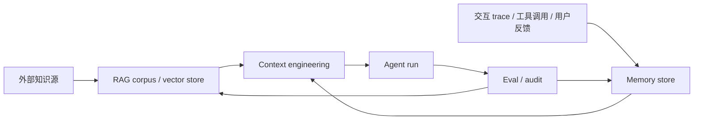

# RAG 与 Memory 边界

RAG 和 Memory 都把信息放在模型上下文之外，并在运行时按需取回。但它们不是同一个东西。

核心边界：**RAG 检索外部知识；Memory 维护主体连续性。**

## 定义

| 维度   | RAG                                             | Memory                                          |
| ---- | ----------------------------------------------- | ----------------------------------------------- |
| 主问题  | “答案依据在哪里？”                                      | “这个 agent / 用户 / 组织已经发生过什么、学到了什么？”              |
| 信息对象 | 文档、知识库、网页、代码、政策、产品手册                            | 偏好、历史决策、任务状态、失败模式、经验、程序化规则                      |
| 生命周期 | 随源文档更新；通常由外部系统管理                                | 随交互持续写入、巩固、衰减、修正                                |
| 可信度  | 依赖来源、引用、检索质量                                    | 依赖 provenance、时间、权限、冲突解决                        |
| 失败模式 | 检索错、chunk 错、引用错、grounded but wrong              | 记错、过时、污染、把旧状态当当前事实                              |
| 评估   | retrieval hit、groundedness、citation correctness | recall、staleness、conflict rate、task improvement |

## 关系

Memory 可以用 RAG 技术实现，但 Memory 的目标更复杂：

- RAG 的重点是“从知识库找相关内容”。
- Memory 的重点是“什么值得记、如何组织、何时遗忘、如何避免旧记忆误导当前环境”。
- RAG 通常读多写少；Memory 读写都重要。
- RAG 的 provenance 来自源文档；Memory 的 provenance 来自交互 trace、agent、时间和权限。

## 决策规则

| 需求                           | 归类                                      |
| ---------------------------- | --------------------------------------- |
| 公司政策、API 文档、产品手册问答           | RAG                                     |
| 用户偏好、长期目标、沟通风格               | Memory                                  |
| 当前任务 checklist、临时 scratchpad | Short-term memory / context engineering |
| 多次任务中反复出现的失败模式               | Long-term memory 或 skill                |
| 可引用的事实来源                     | RAG，必要时进入 semantic memory               |
| 已过期但可能影响判断的历史状态              | Memory，但必须标注时间和 superseded 状态           |

## 稳定架构

## 上下游归属

- 主归属：4. 上下文与知识层
- 上游：RAG 文档库、memory store、trace、用户反馈
- 下游：Agent 系统层、评估可靠性层、自我改进层
- 反哺：失败案例进入 memory；稳定事实进入 RAG/知识库；可复用程序进入 skill。

## 与 Data Flywheel 的接口

[[concepts/DataFlywheelFeedbackLoop边界]] 产生的反馈不能一概进入训练：

- 外部事实缺口优先进入 RAG / knowledge base。
- 用户或组织偏好优先进入 memory / product setting。
- 写入 memory 前先经过 [[concepts/DataRightsPrivacyConsent边界|data rights]]：可见、可删、可关、权限继承。
- 写入 RAG / memory 前也要经过 [[concepts/DataQualityLabelQuality边界|data quality]]：来源、时间、冲突、代表性、chunk 和引用质量。
- 可复用操作模式进入 skill。
- 只有稳定、跨用户、高频且经授权的行为需求，才进入 fine-tuning 候选。

## 过时风险

- 向量库不是 memory；只做 embedding search 会丢失时间、权限、冲突和来源角色。
- 长上下文不是 memory；把历史全塞进 prompt 会触发 [[concepts/上下文腐化]]。
- Memory 不是事实真理源；当前环境优先于旧记忆，旧记忆只能作为 guidance。
- Dream / consolidation 不是装饰，而是 memory 从“日志堆”变成“可用经验”的关键。
- 组织 RAG 和长期 memory 必须继承文档权限、租户边界和删除/保留策略；否则会把第 4 层知识系统变成隐私泄露通道。
- 长期 memory 必须经过 [[concepts/MemorySkillGovernanceDrift边界|memory / skill governance drift]]：写入、巩固、检索和删除都要有 owner、scope、provenance、freshness、permission、poison scan 和 quarantine/retirement 机制。
