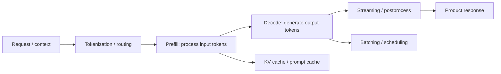

# Serving 成本延迟边界

Serving 是把模型运行时能力变成产品可用能力的工程约束层：同一个模型能力，只有满足延迟、吞吐、成本、稳定性和可观测性约束，才真正能进入产品。

主归属：**3. 推理与能力层**。它发生在模型推理运行时，决定权重和上下文如何被实际执行。

交叉链接：
- **7. 产品与组织层**：成本、延迟、SLO、用户体验和商业模型。
- **6. 评估与可靠性层**：监控 TTFT、TPOT、P95/P99、error rate、goodput 和成本回归。
- **2. 模型构建层**：蒸馏、量化、小模型、speculative decoding 需要回到模型选择或训练。

## 稳定定义

Serving 的核心不是“部署一个模型”，而是把 request 变成满足 SLO 的 token 流。

## 核心指标

| 指标 | 含义 | 主要受什么影响 |
|---|---|---|
| TTFT | first token 到达时间 | 输入 token、prefill、排队、缓存、路由 |
| TPOT / ITL | 每个输出 token 间隔 | decode 效率、batching、GPU 利用率 |
| E2E latency | 从请求到完成 | 输入 + 输出 token、工具调用、网络、postprocess |
| Throughput | 单位时间处理 token 或 request | batching、并发、硬件、模型大小 |
| Goodput | 满足延迟 SLO 的有效吞吐 | 调度、隔离、负载形态 |
| Cost/request | 单次请求成本 | token 数、模型价格、缓存命中、重试 |
| Cost/success | 成功完成一个任务的成本 | eval 通过率、失败重跑、tool loop 长度 |

## 工程旋钮

| 旋钮                             | 改什么            | 代价                   |
| ------------------------------ | -------------- | -------------------- |
| 换模型                            | 速度、价格、质量       | 可能降能力                |
| 减 token                        | 输入/输出成本、延迟     | 可能丢上下文               |
| prompt caching                 | 重复前缀成本和 TTFT   | 需要稳定 prompt 前缀       |
| streaming                      | 感知延迟           | 不一定降低总耗时             |
| batching / continuous batching | 吞吐和 GPU 利用率    | 可能增加单请求等待            |
| KV cache / paged attention     | 显存效率、并发        | 系统复杂度                |
| prefill/decode 分离              | 混合负载下的 goodput | 部署复杂度                |
| quantization / distillation    | 成本、延迟、显存       | 质量回归风险               |
| speculative decoding           | decode latency | 需要 draft model 或系统支持 |

## 与相邻概念的区别

| 概念                         | 区别                                                           |
| -------------------------- | ------------------------------------------------------------ |
| Test-time compute          | TTC 多花运行时计算换质量；serving 决定这些计算是否可承受                           |
| Model routing / mixture    | routing 选择模型、effort、cascade 或 ensemble；serving 执行并记录成本、延迟和吞吐 |
| Fine-tuning / distillation | 把稳定模式压进权重以降成本；serving 负责运行时效率                                |
| Context engineering        | 减少低价值 token；serving 衡量 token 对成本和延迟的影响                       |
| Agent harness              | tool loop 会放大 serving 成本；serving 需要按 trace 计算 cost/success   |
| Product pricing            | pricing 是商业策略；serving 提供真实 unit economics                    |

## 判断顺序

1. 先设产品 SLO：延迟、并发、成本上限、质量下限。
2. 建 eval：质量、失败率、成本、延迟一起测。
3. 优先减 token、换合适模型或加入 [[concepts/ModelRoutingMixture边界|model routing]]。
4. 对重复前缀启用 prompt caching。
5. 对吞吐问题使用 batching、KV cache、paged attention、prefill/decode 优化。
6. 仍不满足时考虑蒸馏、量化、小模型或架构拆分。

## 过时风险

- 具体框架会变，但 prefill/decode、token 成本、缓存、batching、SLO 不会消失。
- 随模型降价，单 token 成本压力会下降；但延迟、吞吐和用户体验仍是产品约束。
- Agent 化会让成本从单次回答转成多步 trace 成本，必须看 cost/success 而不是 cost/call。
