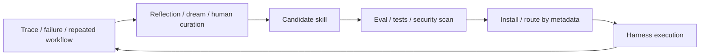

# Skill 与 Tool / Memory / Workflow 边界

Skill 是给 agent 使用的**可版本化程序性知识包**：它把一类任务的做法、约束、脚本、参考资料、模板和触发条件打包，按需加载进上下文，让 agent 不必每次从零推导。

主归属：**4. 上下文与知识层**。Skill 是模型权重之外的程序性知识，解决“当下该让模型知道什么做法”的问题。

交叉链接：
- **5. Agent 系统层**：harness 根据任务路由 skill，并执行其中的工具、脚本或工作流。
- **6. 评估与可靠性层**：skill 需要任务成功率、调用准确率、回归测试和安全扫描。
- **8. 自我改进与前沿层**：反复出现的失败模式可以从 memory / trace 巩固成新 skill。

## 稳定定义

Skill 的稳定形态是目录或包：

- `SKILL.md`：元数据、触发条件和主要 instructions。
- `scripts/`：确定性代码或辅助脚本。
- `references/`：长文档、API 参考、领域规则。
- `assets/`：模板、schema、图片、样例文件。

## 与相邻概念的区别

| 概念 | 边界 |
|---|---|
| Prompt | Prompt 是一次任务的临时指令；skill 是可复用、可版本化、可路由的程序性知识包 |
| Tool | Tool 是可执行动作或 API；skill 说明何时、为何、如何使用工具，也可携带脚本 |
| Workflow | Workflow 是较固定的编排路径；skill 是可复用做法，可调用 workflow，也可指导开放式任务 |
| Memory | Memory 保存经历、偏好和经验；skill 是从反复经验中编译出的程序性记忆 |
| RAG | RAG 检索外部事实；skill 提供 how-to 程序、约束和执行资源 |
| Harness | Harness 是运行时；skill 是 harness 可发现、可加载、可执行的能力包 |

## 上下游

| 方向 | 内容 |
|---|---|
| 上游输入 | 失败 trace、专家流程、团队规范、工具文档、反复任务、memory 中稳定经验 |
| 下游输出 | 可路由 instructions、脚本、参考资料、模板、权限需求、测试用例 |
| 被谁使用 | context engine、agent harness、tool router、eval harness |
| 反哺谁 | memory、tool docs、workflow、eval、产品流程，有时反哺训练数据 |

## 工程实践

- 把 skill 写小，围绕一类明确任务，不把百科全书塞进单个 `SKILL.md`。
- 用 metadata 和 description 负责路由，用 body 负责操作步骤，用 references 承载细节。
- 能脚本化的步骤放进 `scripts/`，让 agent 调用确定性程序，而不是靠自然语言猜。
- 每个 skill 都应有最小 eval：什么时候该调用、调用后任务是否成功、是否引入副作用。
- 第三方 skill 进入团队环境前要做代码审查、依赖检查、权限限制和安全扫描。

## 评估方式

| 评估维度 | 问题 |
|---|---|
| 任务成功率 | 安装 skill 后同类任务 pass rate 是否提升 |
| 调用准确率 | 该用时是否调用，不该用时是否避免调用 |
| 工具正确性 | tool call 参数、顺序、错误恢复是否更稳定 |
| 回归测试 | skill 更新后旧任务是否退化 |
| 安全性 | 是否存在 prompt injection、数据外传、权限扩大、供应链风险 |
| 成本 | metadata 和 `SKILL.md` 是否制造过多 token overhead |

## 过时风险

- 模型能力增强会吞掉部分短小技巧，但领域流程、组织规则、工具细节和安全边界仍需要外部化。
- 过度安装 skill 会增加 metadata token 和路由噪声。
- scripts、依赖和 API 文档会过时；skill 必须像代码一样版本化和回归测试。
- 社区 skill 是供应链入口，不能按普通 Markdown 信任。

## 一句话归类

Skill 是第 4 层的程序性知识包，通过第 5 层 harness 执行，由第 6 层 eval 和安全门约束，并可由第 8 层 self-improvement 从 trace / memory 中持续生成或修订。

当 skill 从单个包扩展到大型库时，问题转为 [[concepts/SkillLibraryRouting生命周期]]：路由、归因、版本、退役和供应链治理。

## 与 Data Flywheel 的接口

[[concepts/DataFlywheelFeedbackLoop边界]] 中的重复成功 trace 和人工修正，是 skill 生成的主要证据来源。

稳定链路：`repeated workflow / corrected trace → candidate skill → routing eval + security scan → install or reject`。

这防止把一次偶然成功、低质量反馈或未授权用户数据直接固化为程序性知识。

[[concepts/DataRightsPrivacyConsent边界]] 进一步约束 skill 生成：用户私有流程、客户数据、凭证、内部文档和敏感 trace 不能因为“有用”就进入共享 skill；skill 的 references、scripts 和 examples 要继承数据来源权限。

[[concepts/ToolRiskPermissioning边界]] 约束 skill 执行：skill 可以建议调用哪些工具，但不能自带或扩大权限；高风险工具仍要经过 runtime policy、sandbox、approval 和 audit。

[[concepts/DataQualityLabelQuality边界]] 约束 skill 生成：只有多次验证、可复现、无 secrets、标签/结果清楚的 trace 才能固化为共享 skill。

[[concepts/MemorySkillGovernanceDrift边界]] 约束 skill 长期维护：`SKILL.md` metadata、references、scripts、allowed tools 和 examples 都会影响未来路由和执行，因此更新、合并、退役、权限继承和语义供应链扫描要像代码资产一样治理。
