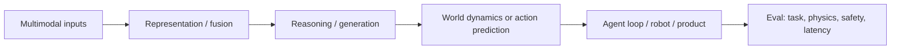

# 多模态与世界模型边界

多模态能力和世界模型能力都属于 [[domains/AI知识体系]] 第 3 层“推理与能力层”，但它们不是同一个概念。

- **多模态**：模型能接收、融合、生成或转换多种模态，如文本、图像、音频、视频、3D、传感器和动作。
- **世界模型**：模型能表示环境状态、时间动态、对象持久性、物理约束、行动后果和反事实轨迹。

一句话：**多模态回答“模型看见/听见/生成哪些信号”，世界模型回答“模型是否理解状态如何随行动和时间变化”。**

## 稳定边界

| 能力 | 判断问题 | 代表例子 |
|---|---|---|
| 多模态理解 | 能否跨文本、图像、音频、视频理解任务 | GPT-4o、Gemini 1.5 |
| 多模态生成 | 能否生成图像、音频、视频等非文本输出 | GPT-4o、Sora |
| 长程多模态上下文 | 能否在长视频、音频、文档中检索和推理 | Gemini 1.5 |
| 世界模拟 | 能否保持对象、空间、物理和时间一致性 | Sora、Genie 2 |
| 行动条件模拟 | 给定 action 后能否预测下一个 observation | Genie 2、World Models |
| VLA / embodied control | 能否把视觉和语言直接转成动作 | RT-2 |

## 层级连接

## 与相邻概念的区别

| 概念 | 区别 |
|---|---|
| Context engineering | 负责把多模态材料组织进上下文；不等于模型具备多模态能力 |
| RAG | 检索外部知识；多模态 RAG 只是把图像/音频/视频纳入检索对象 |
| Test-time compute | 运行时多花计算；多模态/世界模型是模型能力形态 |
| Agent harness | 调度相机、麦克风、屏幕、机器人或仿真环境；不等于模型理解世界 |
| Product surface | 语音助手、视频生成、机器人只是应用；底层能力仍要回到第 3 层评估 |

## 工程实践

- 多模态任务先拆清楚输入模态、输出模态、时序长度、实时性、工具接口和安全约束。
- 世界模型任务必须加入动态一致性、对象持久性、反事实预测、行动后果和物理约束评估。
- VLA / embodied agent 要区分“看懂场景”和“能安全行动”；后者需要环境、控制接口、权限和硬件安全门。
- 视频生成模型可以表现出模拟能力，但不能因为视频逼真就默认它是可靠世界模型。

## 评估方式

详见 [[concepts/MultimodalEvalSimulationEval边界]]：能力归属第 3 层，可靠性验证归属第 6 层。

- 多模态理解：VQA、video QA、ASR、translation、document/video retrieval。
- 多模态生成：人类偏好、文本一致性、时序一致性、artifact rate、安全/版权审查。
- 世界模型：action-conditioned prediction、object permanence、physics consistency、counterfactual rollouts、long-horizon memory。
- Agent/robot：task success、collision/unsafe action、generalization to unseen objects/environments、sim-to-real transfer。
- 产品：延迟、成本、隐私、可解释性、可回滚和人工接管。

## 过时风险

- “多模态”会从前沿卖点变成默认能力，但模态融合、实时性和安全仍是稳定工程问题。
- “世界模型”容易被营销滥用；稳定定义必须包含动态预测、行动后果或反事实，而不只是生成漂亮视频。
- 视频模型的物理一致性仍有限；进入机器人或自动化产品前必须通过环境级 eval。
