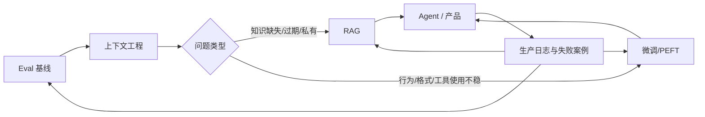

# 微调 RAG 上下文工程选择框架

这个框架回答一个高频问题：当模型表现不好时，应该改 prompt/context、加 RAG，还是微调模型？

核心结论：**先做 eval 和上下文工程；知识问题优先 RAG；行为一致性和成本/延迟问题再考虑微调；成熟后可以组合。**

## 三者的位置

| 技术 | 主归属层级 | 改变什么 | 不改变什么 |
|---|---|---|---|
| 上下文工程 | 4. 上下文与知识层 | 每次推理时进入模型的指令、工具、记忆、历史、检索内容 | 模型权重 |
| RAG | 4. 上下文与知识层 | 运行时可访问的外部知识和出处 | 模型权重 |
| 微调 / PEFT / LoRA | 2. 模型构建层 | 模型参数或适配器，让行为/格式/任务能力更稳定 | 外部事实库的实时更新能力 |

## 决策顺序

1. **先建 eval**：没有基线就无法判断 prompt、RAG 或微调是否真的变好。
2. **先做上下文工程**：明确任务、输入、输出、工具、示例和失败模式。
3. **如果缺的是事实或私有知识，用 RAG**：尤其是知识经常变化、需要出处、文档量大时。
4. **如果缺的是稳定行为，用微调**：例如格式、风格、工具调用、固定任务、复杂边界案例、低延迟。
5. **如果两者都需要，组合**：RAG 提供知识，微调训练模型更好地使用检索上下文。
6. **如果成本太高，考虑蒸馏**：用强模型或生产数据训练更便宜的模型。

## 选择表

| 失败模式                | 首选方案      | 原因                              |
| ------------------- | --------- | ------------------------------- |
| 指令理解不稳定             | 上下文工程     | 先把任务目标、约束、输出格式说清楚               |
| 输出格式总是不一致           | 微调        | 格式/风格属于可学习行为                    |
| 需要回答内部文档            | RAG       | 知识在模型外部，且需要可更新                  |
| 知识每天变化              | RAG       | 不应频繁重新训练权重                      |
| prompt 越写越长，成本和延迟上升 | 微调或蒸馏     | 把反复出现的示例/行为压进模型或小模型             |
| 检索到了内容但模型不会用        | RAG + 微调  | 微调可以训练模型遵循检索上下文                 |
| 工具调用选择不稳定           | 微调 + eval | 工具使用模式可由示例强化，但必须用 trace/eval 验证 |
| 幻觉来自没取到正确文档         | 改 RAG 检索  | 微调不能修复错误检索                      |
| 幻觉来自忽略已给上下文         | 上下文工程或微调  | 先改提示和上下文结构，再用示例训练               |

## 上下游关系

## 评估方式

- 上下文工程：比较同一 eval 集在不同 prompt/context 结构下的通过率、成本、延迟和失败类型。
- RAG：分开评估 retrieval quality、groundedness、answer quality、citation correctness。
- 微调：保留 hold-out eval；比较 base model、prompt-only、RAG-only、fine-tuned、RAG+fine-tuned。
- Agent 场景：必须加入 trace/tool-call eval，不能只看最终回答。

## 过时风险

- 随着上下文窗口变大，简单 few-shot prompt 的空间会变大，但 [[concepts/上下文腐化]] 仍要求管理 token 质量。
- 随着模型变强，部分格式/风格微调需求会下降；但成本、延迟、合规和专用行为仍会保留微调需求。
- 随着检索和 memory 工具变强，RAG 会更像“上下文操作系统”的一部分，而不是单独功能。

## 归属

- 主归属：4. 上下文与知识层
- 交叉链接：2. 模型构建层、6. 评估与可靠性层、7. 产品与组织层
- 上游：[[concepts/AI系统生成链]]、[[concepts/上下文工程]]
- 下游：Agent harness、产品部署、self-improvement loop
